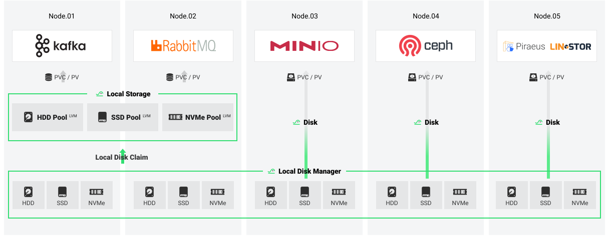

# What is HwameiStor

HwameiStor is a Kubernetes native Container Attached Storage (CAS) solution that makes it possible for stateful applications to easily use dynamic local PVs or replicated PVs.  

HwameiStor creates a local storage resource pool for centrally managing all disks such as HDD, SSD, and NVMe. It uses the CSI architecture to provide distributed services with local volumes, and provides data persistence capabilities for stateful cloud-native workloads or components.

HwameiStor is an open source, lightweight, and cost-efficient local storage system that can replace expensive traditional SAN storage. The system architecture of HwameStor is as follows.

 By using the CAS pattern, users can achieve the benefits of higher performance, better cost-efficiency, and easier management for their container storage. It can be deployed by helm charts or directly use the independent installation. You can easily enable the high-performance local storage across entire cluster with one click and automatically identify disks.

HwameiStor is easy to deploy and ready to go.

## Functional modules

- **Local Storage**
  
  Local Storage provisions two types of local LVM volumes, such as HA and non-HA.

- **Local Disk Manager**
  
  It can abstract the disk on the node into a resource and can be monitored and managed. It's a daemon that will be deployed on each node, then detect the disk on the node, abstract it into local disk (LD) resources and save it to kubernetes.

- **Scheduler**
  
  It is used to automatically schedule the Pod to the correct node which has the associated HwameiStor volume. With the scheduler, the Pod doesn't have to has the NodeAffinity or NodeSelector field to select the node. A scheduler will work for both LVM and Disk volumes.

## Terminology

- **LocalDisk (LD)**
  
  It refers to local disk resources. An LD represents a physical disk on the node.

- **LocalDiskClaim**
  
  The way to use disk, users can request disks by creating the Claim object.

- **LocalVolume (LV)**
  
  It is a logical concept in the system. The master node accepts external requests (such as Kubernetes PVCs), creates LocalVolume and LocalVolumeReplica according to the current global information of the cluster, and assigns LocalVolumeReplica to the corresponding nodes.

- **LocalVolumeReplica**
  
  The LocalVolumeReplica resource is created by the master node when a Volume is created or updated. The LocalVolumeReplica is assigned to the specified node that creates/manages the local storage (e.g. LV) based on its content, and maintains it in real-time.

- **Logical Volume Manager (LVM)**
  
  It adds a logical layer between the disk partition and the file system, provides an abstract disk volume for the file system to shield the underlying disk partition layout, and establishes a file system on the disk volume.

- **LocalStorageNode**
  
  Each node should create its own Node CRD resource and proactively maintain and update relevant information.