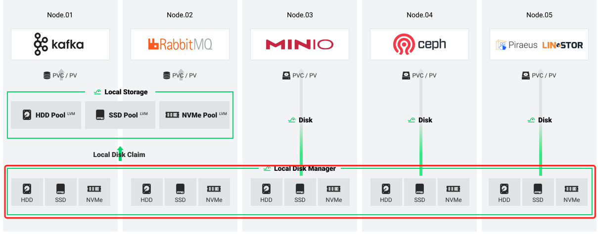

# Local Disk Manager

Local Disk Manager (LDM) is one of the modules of HwameiStor. `LDM` is used to simplify the management of disks on nodes. It can abstract the disk on a node into a resource for monitoring and management purposes. It's a daemon that will be deployed on each node, then detect the disk on the node, abstract it into local disk (LD) resources and save it to kubernetes.



At present, the LDM project is still in the `alpha` stage.

## Concepts

LocalDisk (LD): LDM abstracts disk resources into objects in kubernetes. An `LD` resource object represents the disk resources on the host.

LocalDiskClaim (LDC): This is a way to use disks. A user can add the disk description to select a disk for use.

> At present, LDC supports the following options to describe disk:
> 
> - NodeName
> - Capacity
> - DiskType (such as HDD/SSD/NVMe)

## Usage

If you want to entirely deploy HwameiStor, refer to [Usage with Helm Chart](../../2.quick_start/2.1.installation/2.1.2.deploy_helm_charts.md).

If you just want to deploy LDM separately, refer to the following installation procedure.

## Install Local Disk Manager

1. Clone the repo to your machine.

    ```bash
    git clone https://github.com/hwameistor/local-disk-manager.git
    ```

2. Change to the deploy directory.

    ```bash
    cd deploy
    ```

3. Deploy CRDs and run local-disk-manager.

    3.1 Deploy LD and LDC CRDs.

    ```bash
    kubectl apply -f deploy/crds/
    ```

    3.2. Deploy RBAC CRs and operators.

    ```bash
    kubectl apply -f deploy/
    ```

4. Get the LocalDisk information.

    ```bash
    kubectl get localdisk
    10-6-118-11-sda    10-6-118-11                             Unclaimed
    10-6-118-11-sdb    10-6-118-11                             Unclaimed
    ```

Get locally discovered disk resource information with four columns displayed.

- **NAME:** represents how this disk is displayed in the cluster resources.
- **NODEMATCH:** indicates which host this disk is on.
- **CLAIM:** indicates which `Claim` statement this disk is used by.
- **PHASE:** represents the current state of the disk.

Use `kuebctl get localdisk <name> -o yaml` to view more information about disks.

5. Claim available disks.

    5.1 Apply a LocalDiskClaim.

    ```bash
    kubectl apply -f deploy/samples/hwameistor.io_v1alpha1_localdiskclaim_cr.yaml
    ```

    Allocate available disks by issuing a disk usage request. In the request description, you can add more requirements about the disk, such as disk type and capacity.

    5.2 Get the LocalDiskClaim infomation.

    ```bash
    kubectl get localdiskclaim <name>
    ```

    Check the status of `Claim`. If a disk is available, you will find that the status is changed to `Bound`, the localdisk status will be Claimed, and it points to the claim that references the disk.

## Roadmap

| Feature| Status| Release| Description
|:----------|----------|----------|----------
| CSI for disk volume| Planed| | `CSI` driver for provisioning Local PVs with bare `Disk`
| Disk management| Planed| | Disk management, disk allocation, disk event aware processing
| Disk health management| Planed| | Disk health management
| HA disk Volume| Planed| | HA disk Volume
