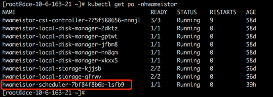
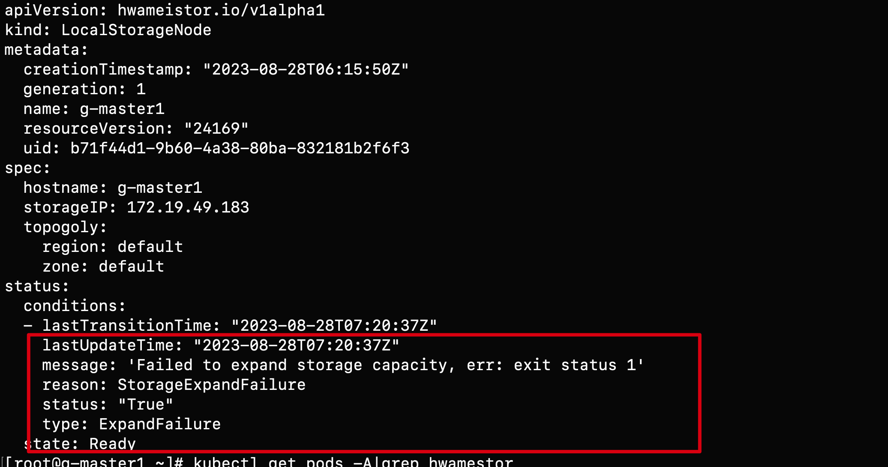

# FAQs

## Q1: How does hwameistor-scheduler work in a Kubernetes platform?

The hwameistor-scheduler is deployed as a pod in the hwameistor namespace.



Once the applications (Deployment or StatefulSet) are created, the pod will
be scheduled to the worker nodes on which HwameiStor is already configured.

## Q2: How to schedule applications with multi-replica workloads?

This question can be extended to:
How does HwameiStor schedule applications with multi-replica workloads and how does it differ from traditional shared storage (NFS/block)?

To efficiently schedule applications with multi-replica workloads, we highly recommend using StatefulSet.

StatefulSet ensures that replicas are deployed on the same worker node as the original pod.
It also creates a PV data volume for each replica. If you need to deploy replicas on different
worker nodes, manual configuration with `pod affinity` is necessary.


We suggest using a single pod for deployment because the block data volumes can not be shared.

## Q3: How to maintain a Kubernetes node?

HwameiStor provides the volume eviction/migration functions to keep the Pods and HwameiStor
volumes' data running when retiring/rebooting a node.

### Remove a node

Before you remove a node from a Kubernetes cluster, the Pods and volumes on the node should be
rescheduled and migrated to another available node, and keep the Pods/volumes running.

Follow these steps to remove a node:

1. Drain node.

    ```bash
    kubectl drain NODE --ignore-daemonsets=true. --ignore-daemonsets=true
    ```

    This command can evict and reschedule Pods on the node. It also automatically
    triggers HwameiStor's data volume eviction behavior. HwameiStor will automatically
    migrate all replicas of the data volumes from that node to other nodes, ensuring data availability.

2. Check the migration progress.

    ```bash
    kubectl get localstoragenode NODE -o yaml
    ```

    The output may look like:

    ```yaml
    apiVersion: hwameistor.io/v1alpha1
    kind: LocalStorageNode
    metadata:
      name: NODE
    spec:
      hostname: NODE
      storageIP: 10.6.113.22
      topogoly:
        region: default
        zone: default
    status:
      ...
      pools:
        LocalStorage_PoolHDD:
          class: HDD
          disks:
          - capacityBytes: 17175674880
            devPath: /dev/sdb
            state: InUse
            type: HDD
          freeCapacityBytes: 16101933056
          freeVolumeCount: 999
          name: LocalStorage_PoolHDD
          totalCapacityBytes: 17175674880
          totalVolumeCount: 1000
          type: REGULAR
          usedCapacityBytes: 1073741824
          usedVolumeCount: 1
          volumeCapacityBytesLimit: 17175674880
          ## **** make sure volumes is empty **** ##
          volumes:  
      state: Ready
    ```

    At the same time, HwameiStor will automatically reschedule the evicted Pods
    to the other node which has the associated volume replica, and continue to run.

3. Remove the NODE from the cluster.

    ```bash
    kubectl delete nodes NODE
    ```

### Reboot a node

It usually takes a long time (~10minutes) to reboot a node. All the Pods and volumes on
the node will not work until the node is back online. For some applications like DataBase,
the long downtime is very costly and even unacceptable.

HwameiStor can immediately reschedule the Pod to another available node with associated
volume data and bring the Pod back to running in very short time (~ 10 seconds for the
Pod using a HA volume, and longer time for the Pod with non-HA volume depends on the data size).

If users wish to keep data volumes on a specific node, accessible even after the node restarts,
they can add the following labels to the node. This prevents the system from migrating the data volumes
from that node. However, the system will still immediately schedule Pods on other nodes that have
replicas of the data volumes.

1. Add a label (optional)

    If it is not required to migrate the volumes during the node reboots,
    you can add the following label to the node before draining it.

    ```bash
    kubectl label node NODE hwameistor.io/eviction=disable
    ```

2. Drain the node.

    ```bash
    kubectl drain NODE --ignore-daemonsets=true. --ignore-daemonsets=true
    ```

    - If Step 1 has been performed, you can reboot the node after Step 2 is successful.
    - If Step 1 has not been performed, you should check if the data migration is complete
      after Step 2 is successful (similar to Step 2 in [remove node](#remove-a-node)).
      After the data migration is complete, you can reboot the node.

    After the first two steps are successful, you can reboot the node and wait for the node system to return to normal.

3. Bring the node back to normal.

    ```bash
    kubectl uncordon NODE
    ```

### Traditional shared storage

StatefulSet, which is used for stateful applications, prioritizes deploying replicated replicas
to different nodes to distribute the workload. However, it creates a PV data volume
for each Pod replica. Only when the number of replicas exceeds the number of worker nodes,
multiple replicas will be deployed on the same node.

On the other hand, Deployments, which are used for stateless applications, prioritize deploying
replicated replicas to different nodes to distribute the workload. All Pods share a single PV data volume
(currently only supports NFS). Similar to StatefulSets, multiple replicas will be deployed on the same node
only when the number of replicas exceeds the number of worker nodes. For block storage, as data volumes
cannot be shared, it is recommended to use a single replica.

## Q4: How to handle the error when encountering "LocalStorageNode" during inspection?

When encountering the following error while inspecting `LocalStorageNode`:



Possible causes of the error:

1. The node does not have LVM2 installed. You can install it using the following command:

   ```bash
   rpm -qa | grep lvm2  # Check if LVM2 is installed
   yum install lvm2  # Install LVM on each node
   ```

2. Ensure that the proper disk on the node has GPT partitioning.

   ```bash
   blkid /dev/sd*  # Confirm if the disk partitions are clean
   wipefs -a /dev/sd*  # Clean the disk
   ```

## Q5: Why is StorageClasses not automatically created after installation using Hwameistor-operator?


possible reason:

1. The node has no remaining bare disks that can be automatically managed. You can check it by running the following command:

    ```bash
    kubectl get ld # Check disk
    kubectl get lsn <node-name> -o yaml # Check whether the disk is managed normally
    ```

2. The hwameistor related components [excluding drbd-adapter] are not working properly. You can check it by running the following command:

    ```bash
    kubectl get pod -n hwameistor # Confirm whether the pod is running 
    kubectl get hmcluster -o yaml # View the health field
    ```