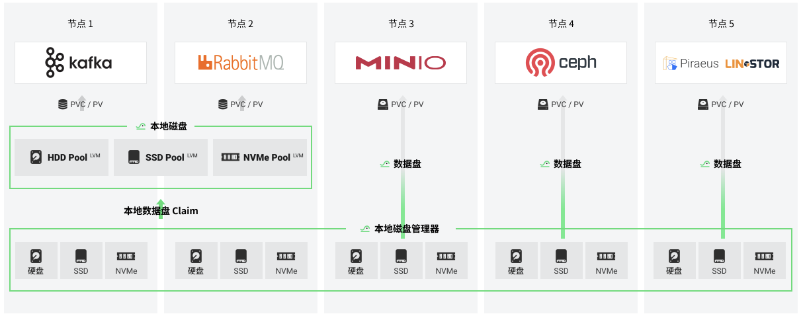

# 什么是 HwameiStor

HwameiStor 是一款 Kubernetes 原生的容器附加存储 (CAS) 解决方案，将 HDD、SSD 和 NVMe 磁盘形成本地存储资源池进行统一管理，使用 CSI 架构提供分布式的本地数据卷服务，为有状态的云原生应用或组件提供数据持久化能力。

## 功能特性

1. 自动化运维管理

   可以自动发现、识别、管理、分配磁盘。 根据亲和性，智能调度应用和数据。自动监测磁盘状态，并及时预警。

2. 高可用的数据

   使用跨节点副本同步数据， 实现高可用。发生问题时，会自动将应用调度到高可用数据节点上，保证应用的连续性。

3. 丰富的数据卷类型

   聚合 HDD、SSD、NVMe 类型的磁盘，提供非低延时，高吞吐的数据服务。

4. 灵活动态的线性扩展

   可以根据集群规模大小进行动态的扩容，灵活满足应用的数据持久化需求。

## 系统架构

HwameiStor 的系统架构图如下：

- **本地存储**

  即 local-storage，负责提供 LVM 本地数据卷，包括高可用 LVM 数据卷、非高可用 LVM 数据卷。

- **本地磁盘管理器**

  它将磁盘抽象成一种可以被管理和监控的资源。本身是一种 DaemonSet 对象，集群中每一个节点都会运行该服务，通过该服务检测存在的磁盘并将其转换成相应的 LocalDisk 资源。

- **调度器**

  自动将 Pod 调度到配有 HwameiStor 存储卷的正确节点。使用调度器后，Pod 不必再使用 NodeAffinity 或 NodeSelector 字段来选择节点。调度器能处理 LVM 和 Disk 存储卷。

## 术语

- **LocalDisk (LD)**

  本地磁盘资源，一个 LD 代表了节点上的一块物理磁盘。

- **LocalDiskClaim**

  这是系统使用磁盘的方式，通过创建 Claim 对象来向系统申请磁盘。

- **LocalVolume (LV)**

  在系统中是一个逻辑概念，控制节点接受外部请求（例如 Kubernetes 的 PVC），根据当时的集群全局信息，创建 LocalVolume 以及LocalVolumeReplica，并将 LocalVolumeReplica 分配给相应的节点。

- **LocalVolumeReplica**

  LocalVolumeReplica 资源是控制节点在创建或更新 Volume 时创建的。LocalVolumeReplica 分配给指定节点，并由该节点根据其内容创建/管理本地存储（例如 LocalVolume），并实时进行维护。

- **Logical Volume Manager (LVM)**

  即逻辑卷管理，在磁盘分区和文件系统之间添加一个逻辑层，为文件系统屏蔽下层磁盘分区布局提供一个抽象的盘卷，并在盘卷上建立文件系统。

- **LocalStorageNode** 

  每个节点都应创建一个自己的节点 CRD 资源，并主动维护、更新相关信息。
